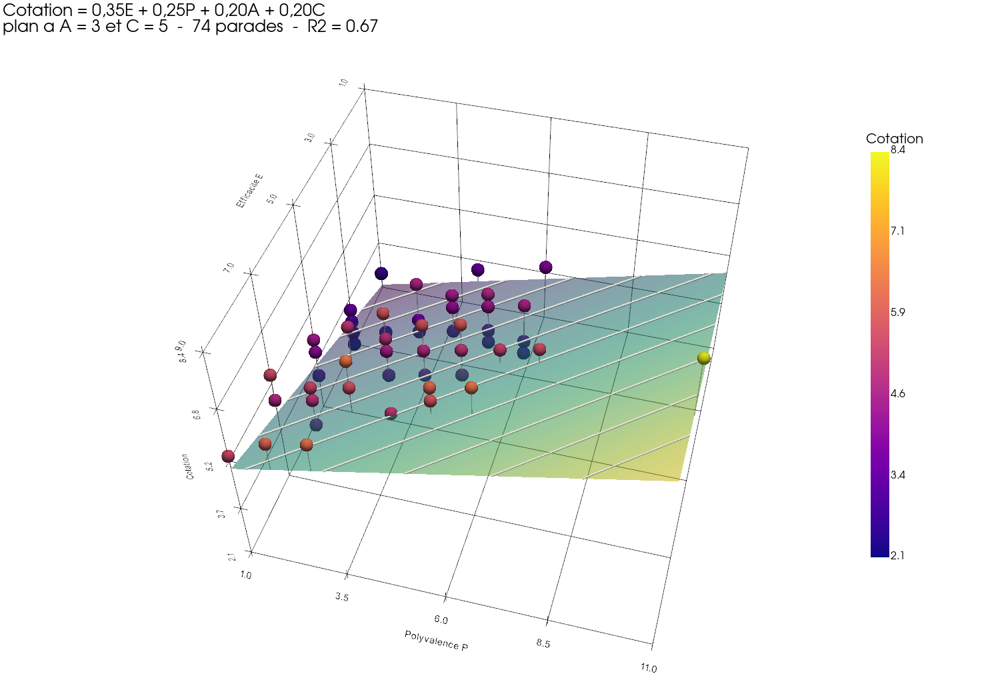
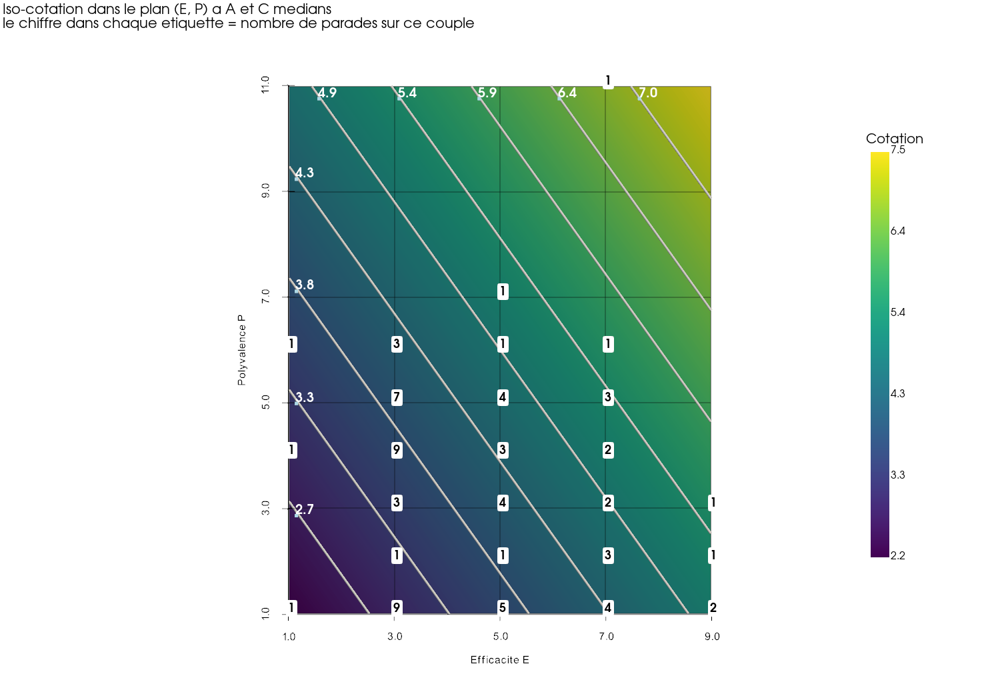
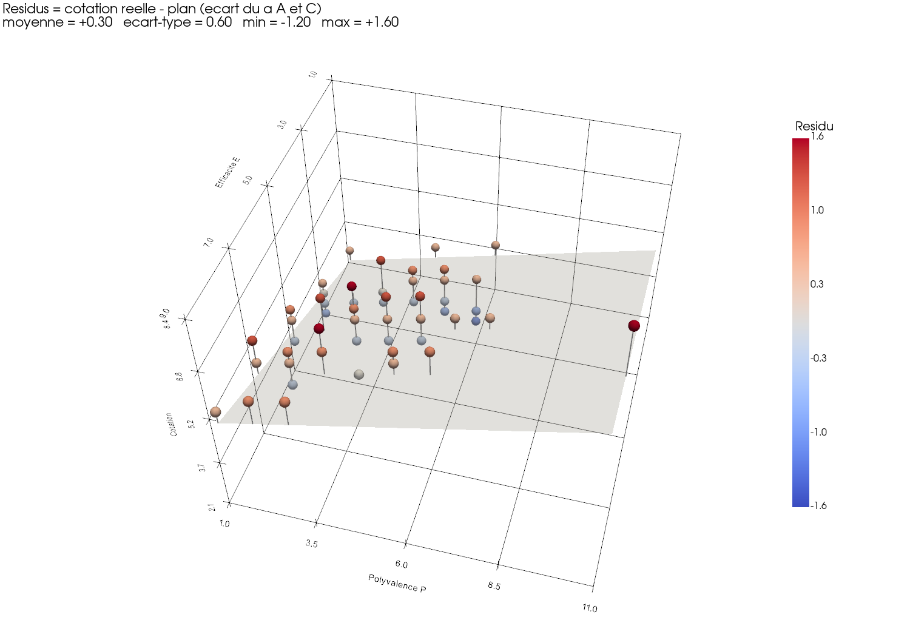
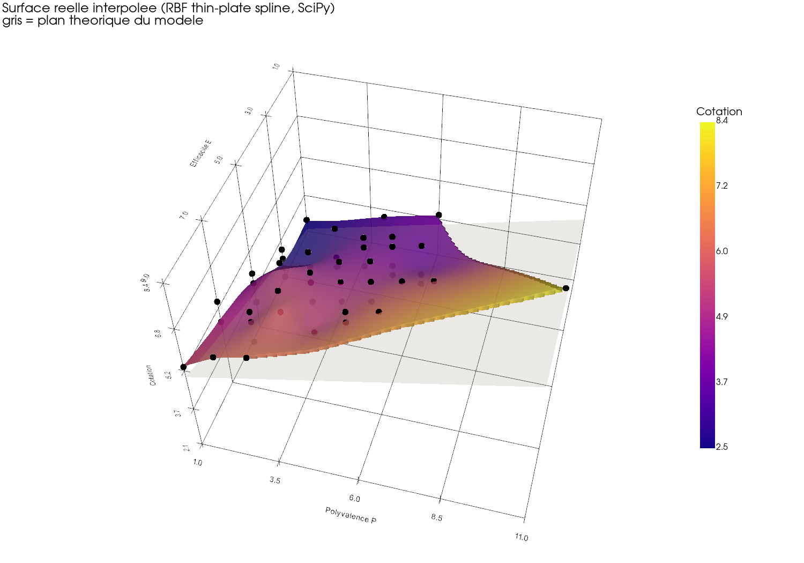
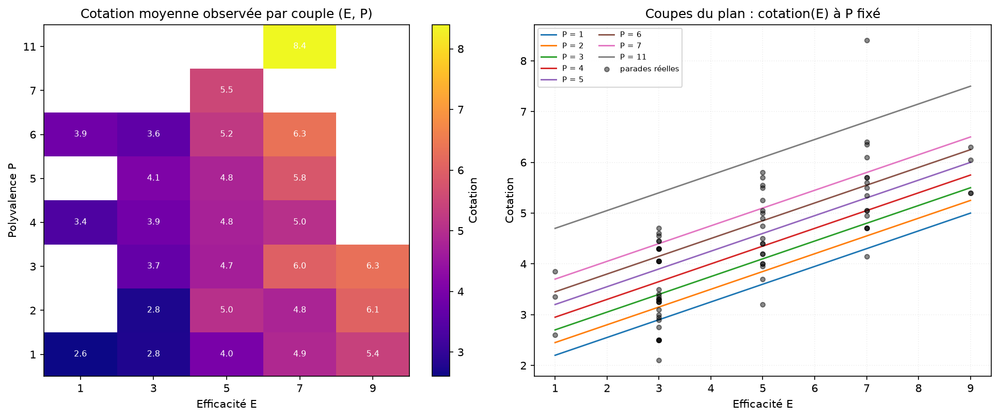

# Cyber countermeasure scoring: model, control and visualisation

**[English](#english) · [Français](#français)**

---

## English

Analysis and visualisation of a multi-criteria scoring grid used to prioritise countermeasures
(security controls) in a cyber risk assessment.

Each countermeasure is rated on four criteria: **effectiveness (E)**, **versatility (P)**,
**applicability (A)** and **cost (C)**. It then receives an aggregate score through a weighted sum:

```
Score = 0.35·E + 0.25·P + 0.20·A + 0.20·C
```

The code in this repository does two things. It **checks** that the score actually applied to the
74 countermeasures matches the documented scale, and it **makes that scale readable**.

> The figures are labelled in French, since they come from the original report. The captions below
> explain what each one shows.

### Model plane and actual countermeasures



The plane is the score predicted by the scale, drawn with A and C fixed at their medians. Each
sphere is a real countermeasure, tied to the plane by a stem whose length measures the deviation
contributed by the two frozen criteria. At median A and C, E and P alone account for **67 % of the
variance** in the observed scores.

### Iso-score map



Top view of the same plane. The light lines are contour lines: every countermeasure sitting on one
of them receives the same score. The number in each label gives how many countermeasures share
that (E, P) pair. This is the figure that best shows where the reference grid is **saturated**: the
pairs (E=3, P=1) and (E=3, P=4) hold 9 countermeasures each, and (E=3, P=5) holds 7. It also shows
where the grid stays **empty**, in particular the whole top-right quadrant combining high
effectiveness with high versatility.

### Residuals



Difference between the actual score and the plane, coloured by sign. Mean +0.30, standard deviation
0.60, range from −1.20 to +1.60. The positive bias is not noise: it indicates that the
countermeasures in the database have, on average, more favourable applicability and cost than the
median, which means the reference grid leans slightly towards optimism.

### Interpolated surface against theoretical plane



Interpolation of the observed scores with a thin-plate spline (RBF, SciPy), masked to the convex
hull of the data points so that nothing is extrapolated beyond the domain actually covered. The
grey plane underneath is the theoretical model. Where the two separate, the applied score departs
from the documented scale.

### Observed scores and plane sections



On the left, the mean score actually observed for each (E, P) pair. White cells are combinations
that never occurred. On the right, sections of the plane at fixed P, overlaid on the real scatter:
the expected growth along E holds, and the vertical spread at a given E makes visible the share of
the score that comes from A and C.

### Method

- **Excel parsing** with `openpyxl` in `data_only=True`. This is essential here: column E is a
  `COUNTIF` whose computed value is needed, not its formula.
- **Weight re-estimation** by least squares (`scipy.linalg.lstsq`), compared against the documented
  weights, as a consistency check between the written scale and the applied one.
- **Correlations**, Pearson and Spearman, criterion by criterion, to tell a linear relationship
  from simple monotonicity.
- **One-sample t-test on the residuals** (null hypothesis: zero mean) and **Mann-Whitney** between
  the two countermeasure statuses. The latter is non-parametric, the scores being on a discrete
  scale.
- **RBF interpolation**, thin-plate spline with smoothing, masked by Delaunay triangulation.
- **Rendering** in two sets: `matplotlib` for figures meant to be dropped into a report,
  `pyvista`/VTK for the 3D views and an HTML export that can be rotated with the mouse. The 3D
  views go through a normalised rendering frame, without which the plane comes out flattened.

### Stack

`Python` · `NumPy` · `pandas` · `SciPy` (stats, interpolate, spatial, linalg) · `matplotlib` ·
`PyVista` / VTK · `openpyxl`

### A note on the data

The original dataset comes from an internal risk assessment and is not published. The figures in
this repository contain aggregate quantities only.
---

## Français

Analyse et visualisation d'une grille de cotation multicritère utilisée pour prioriser des
parades (mesures de sécurité) dans une analyse de risque cyber.

Chaque parade est notée sur quatre critères : **efficacité (E)**, **polyvalence (P)**,
**applicabilité (A)** et **coût (C)**. Elle reçoit ensuite une note agrégée par somme pondérée :

```
Cotation = 0,35·E + 0,25·P + 0,20·A + 0,20·C
```

Le code de ce dépôt fait deux choses. Il **vérifie** que la cotation appliquée aux 74 parades
correspond bien au barème annoncé, et il la **rend lisible**.
### Le plan du modèle et les parades réelles


Le plan est la cotation prédite par le barème, tracé à A et C fixés à leur médiane. Chaque sphère
est une parade réelle, reliée au plan par une tige dont la longueur mesure l'écart apporté par les
deux critères qu'on a figés. À A et C médians, E et P expliquent à eux seuls **67 % de la
variance** des cotations observées.

### La carte d'iso-cotation


Vue de dessus du même plan. Les lignes claires sont les courbes de niveau : toutes les parades
posées sur une même ligne reçoivent la même note. Le chiffre dans chaque étiquette donne le nombre
de parades partageant ce couple (E, P). C'est la figure qui montre le mieux où le référentiel est
**saturé** : les couples (E=3, P=1) et (E=3, P=4) concentrent 9 parades chacun, (E=3, P=5) en porte
7. Elle montre aussi où il reste **vide**, notamment tout le quart haut-droit à forte efficacité et
forte polyvalence.

### Les résidus


Écart entre la cotation réelle et le plan, coloré selon le signe. Moyenne +0,30, écart-type 0,60,
étendue de −1,20 à +1,60. Le biais positif n'est pas du bruit : il indique que les parades de la
base ont en moyenne une applicabilité et un coût plus favorables que la médiane, autrement dit que
le référentiel penche légèrement vers l'optimisme.

### Surface réelle interpolée contre plan théorique


Interpolation des cotations observées par spline plaque mince (RBF, SciPy), masquée à l'enveloppe
convexe des points de données pour ne rien extrapoler hors du domaine réellement couvert. Le plan
gris en dessous est le modèle théorique. Les décollements entre les deux localisent les zones où la
cotation appliquée s'écarte du barème.

### Cotations observées et coupes du plan


À gauche, la cotation moyenne réellement observée par couple (E, P). Les cases blanches sont les
combinaisons jamais rencontrées. À droite, les coupes du plan à P fixé, superposées au nuage réel :
la croissance attendue en E est bien respectée, et la dispersion verticale à E donné rend visible
la part de cotation qui vient de A et de C.

### Méthode

- **Lecture Excel** avec `openpyxl` en `data_only=True`. C'est indispensable ici : la colonne E est
  un `COUNTIF` dont on veut la valeur calculée, pas la formule.
- **Ré-estimation des poids** par moindres carrés (`scipy.linalg.lstsq`) et comparaison aux poids
  documentés, pour contrôler la cohérence entre le barème écrit et le barème appliqué.
- **Corrélations** de Pearson et de Spearman critère par critère, pour distinguer une relation
  linéaire d'une simple monotonie.
- **Test t sur les résidus** (hypothèse nulle : moyenne nulle) et **Mann-Whitney** entre les deux
  statuts de parade. Ce dernier est non paramétrique, les cotations étant sur une échelle discrète.
- **Interpolation RBF** thin-plate spline avec lissage, masquée par triangulation de Delaunay.
- **Rendu** en deux jeux : `matplotlib` pour les figures d'insertion dans un rapport,
  `pyvista`/VTK pour la 3D et un export HTML manipulable à la souris. La 3D passe par un repère de
  rendu normalisé, sans quoi le plan est écrasé.

### Stack

`Python` · `NumPy` · `pandas` · `SciPy` (stats, interpolate, spatial, linalg) · `matplotlib` ·
`PyVista` / VTK · `openpyxl`


### Note sur les données

Le jeu de données d'origine provient d'une analyse de risque interne et n'est pas publié. Les
figures de ce dépôt ne contiennent que des grandeurs agrégées.
